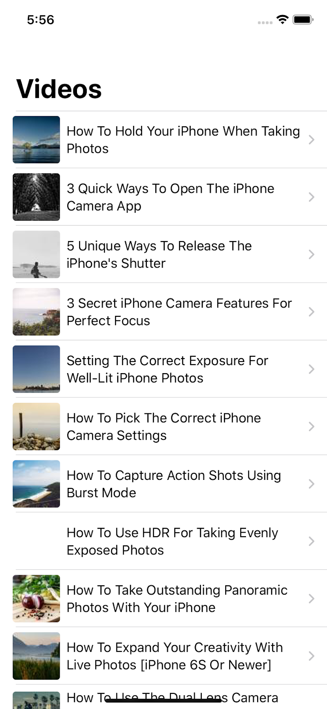
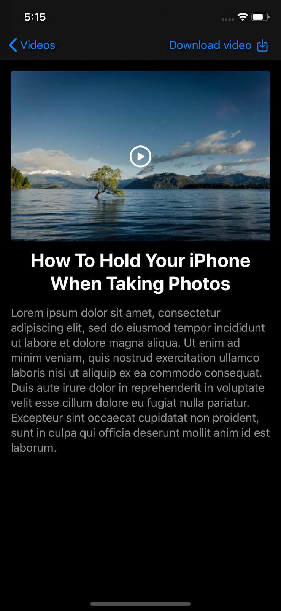

## iOS Developer Test Assignment

### Task

Create an application from scratch where users can pick a video from a list and watch it in the details view. Also they have to be able to download and watch the video when there's no internet connection.

Please make sure you are following all guidelines before submitting your solution.

### Requirements

Video list screen:
- Display title “_Videos_”;
- Display a list of videos;
- Display a thumbnail image and name for each video;
- Implemented pull-to-refresh functionality to refresh the list of videos;
- List of videos has to be fetched, from URL or cache, on application launch.

Video details screen:
- Display video player;
- Display a “_Download video_” button to start download for offline viewing;
- Display a “_Cancel download_” and progress bar when video is downloading;
- Display video title and description.

API endpoint: `https://iphonephotographyschool.com/test-api/videos`.

### Design

Design has to closely match the following screenshots and look good in both, light and dark modes.

### What we are looking for:

- Develop the application using:
  - Xcode;
  - CocoaPods;
  - SwiftUI;
  - Combine.
- Try to use as few 3rd-party libraries as possible. It's fine to use CocoaPods for pull-to-refresh and Alamofire;
- Application has to work offline with cached video list;
- Write automated tests using framework of your choice. Tests have to be meaningful and comprehensive and cover all important functionality of the application. 

### Submission

Project should be stored in your own GitHub repository. Repository should contain commits representing different stages of progress.

Make sure that all tests pass before submitting.

## Result

